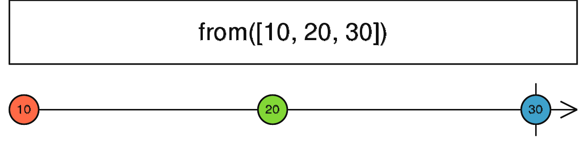

**3PillarGlobal - Training**

Developed by Edwin Sandoval - Frontend Technical Lead
# Laboratory: Introduction to RXJS - Part 2

In this session we're going to learn how to create observables using the next reactive functions:

- of
- from
- interval
- timer
- fromFetch

### 1.- of()

This function converts an argument passed as param to an Observable.

> Note.- In this diagram we can see that after passing the values 1, 2 and 3, those params are emitted to any subscriber function and after it, it emit a completed state.

Example 1 - [Stackblitz Source Code](https://stackblitz.com/edit/rxjs-3xbmlu?file=index.ts)

    import { of } from 'rxjs';

    of(1, 2, 3)
        .subscribe({
            next: value => console.log('emit:', value),
            error: err => console.log('error:', err),
            complete: () => console.log('completed'),
        });
 
### 2.- from()

This function creates an Observable from an Array, an array-like object or Promise.

> Note.- In this diagram we can see that after passing the an array with the values 10, 20 and 30, those value are emitted to any subscriber function and after it, it emit a completed state.

Example 2 - [Stackblitz Source Code](https://stackblitz.com/edit/rxjs-3xbmlu?file=index.ts)

    import { from } from 'rxjs';

    const array = [10, 20, 30];

    from(array)
        .subscribe((x) => console.log(x));

### 3.- interval()

Creates an Observable that emits sequential numbers every specified interval of time.

> Note.- In this diagram we can see that after defining 1 sec as interval an Observable is emitted. For this example we limit the amount to 4 values and then it completes.

Example 3 - [Stackblitz Source Code](https://stackblitz.com/edit/rxjs-3xbmlu?file=index.ts)

    import { interval, take } from 'rxjs';

    const numbers = interval(1000);
 
    const takeFourNumbers = numbers.pipe(take(4));
 
    takeFourNumbers
        .subscribe({
            next: (x) => console.log('Emit: ', x),
            error: (err) => console.log('error:', err),
            complete: () => console.log('completed'),
        });

### 4.- timer()

Wait 5 seconds and start emitting an Observable.

Example 4 - [Stackblitz Source Code](https://stackblitz.com/edit/rxjs-3xbmlu?file=index.ts)

    import { of, timer, tap, concatMap } from 'rxjs';

    const source = of(1, 2, 3);

    timer(5000)
        .pipe(
            tap(_ => console.log('Example 4')),
            concatMap(() => source)
        )
        .subscribe({
            next: (x) => console.log('Emit: ', x),
            error: (err) => console.log('error:', err),
            complete: () => console.log('completed'),
        });

> Note.- In this last example we use two operators (tap and ConcatMap), that we're going to explain in the next videos.