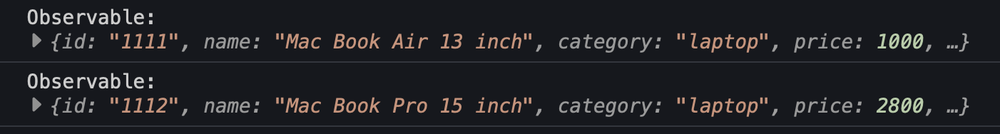
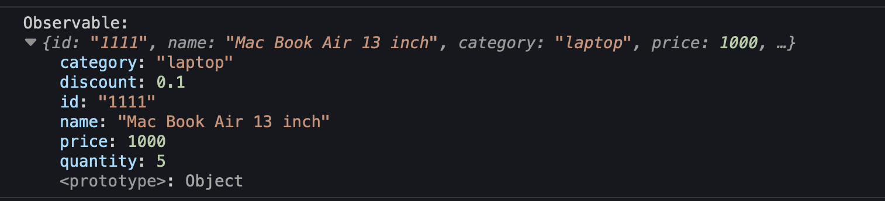
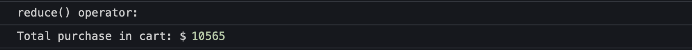

**3PillarGlobal - Training**

Developed by Edwin Sandoval - Frontend Technical Lead
# Laboratory: Introduction to RXJS - Part 3

In this session we're going to learn how to apply different operators for transforming a data stream:

- filter()
- map()
- reduce()

Let's begin defining the data that we're going to use in this tutorial:

    const productsInCart = [
        {
            id: '1111',
            name: 'Mac Book Air 13 inch',
            category: 'laptop',
            price: 1000,
            quantity: 5
        },
        {
            id: '1112',
            name: 'Mac Book Pro 15 inch',
            category: 'laptop',
            price: 2800,
            quantity: 1
        },
        {
            id: '1113',
            name: 'Apple Magic Mouse 1 gen',
            category: 'mouse',
            price: 100,
            quantity: 5
        },
        {
            id: '1114',
            name: 'Apple Magic Mouse 2 gen',
            category: 'mouse',
            price: 260,
            quantity: 1
        },
        {
            id: '1115',
            name: 'Apple iPad Pro 10 gen',
            category: 'ipad',
            price: 449,
            quantity: 3
        },
        {
            id: '1115',
            name: 'Apple iPad Pro 9 gen',
            category: 'ipad',
            price: 329,
            quantity: 2
        },
    ];

### filter()

This operator allow us to extract from data stream (observables source) only the observables that pass the condition defined as param.

In the next example, we're filtering only the products that have the category property with the laptop value:

    import { from, filter } from 'rxjs';

    const productsInCart = [
        ...
    ];

    const source = from(productsInCart)
        .pipe(
            filter(p => p.category === 'laptop')
        );

    source.subscribe({
        next: value => console.log('Observable:', value),
    });

Example - [Stackblitz Source Code](https://stackblitz.com/edit/rxjs-77uvpk?file=index.ts)

### map()

This operator allow us to transform each observable emitted.

In the next example, we're going to add a new property, the name should be discount and it should have 0.10 for products with category laptop. For the other products the discount should be 0.

    import { from, map } from 'rxjs';

    const productsInCart = [
        ...
    ];

    const source2 = from(productsInCart)
    .pipe(
        map(
        p => {
            return {
                ...p,
                discount: p.category === 'laptop' ? 0.1 : 0
            };
        })
    );

    source2.subscribe({
        next: value => console.log('Observable:', value),
    });

Example - [Stackblitz Source Code](https://stackblitz.com/edit/rxjs-77uvpk?file=index.ts)

### reduce()

This operator allow us to reduce to one value a set of values, this function is very useful when we want to count values making use of accumulated value.

    import { from, map, reduce } from 'rxjs';

    const productsInCart = [
        ...
    ];

    const source3 = from(productsInCart)
    .pipe(
        map(p => p.price * p.quantity),
        reduce((accumulator, current) => accumulator + current, 0)
    );

    source3.subscribe({
        next: value => console.log('Total purchase in cart: $', value),
    });

Example - [Stackblitz Source Code](https://stackblitz.com/edit/rxjs-77uvpk?file=index.ts)

