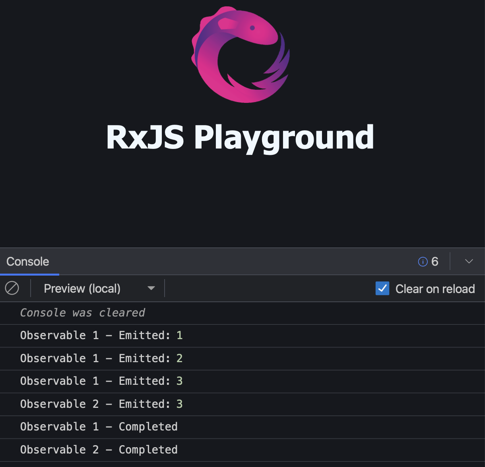

**3PillarGlobal - Training**

Developed by Edwin Sandoval - Frontend Technical Lead
# Laboratory: Introduction to RXJS - Part 4

In this session we're going to learn how to perform the multicasting to many Observers.

Let's start explaining what is an Observer.

An Observer is a consumer of the values emitted by an Observable, for example:

    const observable = of(1,2,3);

    const observer = {
        next: value => console.log('emit:', value),
        error: err => console.log('error:', err),
        complete: () => console.log('completed'),
    } 

    obs.subscribe(observer);

In order to be able to consume the values emitted by an Observable, we must perform a call to the subscribe method of the Observable and pass as param the Observer that is going to handle every value emitted.

Now it's time to present a special kind of Observable:

### Subject()

This call create a special kind of Observable that allow us to perform the multicasting of any value to many Observers.

Example - [Stackblitz Source Code](https://stackblitz.com/edit/rxjs-tnw9tz?file=index.ts)

    import { Subject } from 'rxjs';

    // Create a new Subject instance
    const subject = new Subject();

    // This is the first Observer
    const observer1 = {
        next: value => console.log('Observable 1 - Emitted:', value),
        error: err => console.log('Observable 1 - Error:', err),
        complete: () => console.log('Observable 1 - Completed'),
    };

    // This is the second Observer
    const observer2 = {
        next: value => console.log('Observable 2 - Emitted:', value),
        error: err => console.log('Observable 2 - Error:', err),
        complete: () => console.log('Observable 2 - Completed'),
    };

    // Create the first Observable that is going to be handled by the observer1
    const observable1 = subject.asObservable();
    observable1.subscribe(observer1);

    subject.next(1);
    subject.next(2);

    // Create the second Observable that is going to be handled by the observer2
    const observable2 = subject.asObservable();
    observable2.subscribe(observer2);

    subject.next(3);
    subject.complete();

As result of executing this code, we're going to get the next results:

This code show us that in order to be able to emit a value, we must call to the ***next()*** method of the ***subject***.

If the Observer that is going to recieve the values already exits and is subscribed to the Observable, those values are printed.

When we finished of working with the ***subject***, we should call to the ***complete()*** method.
