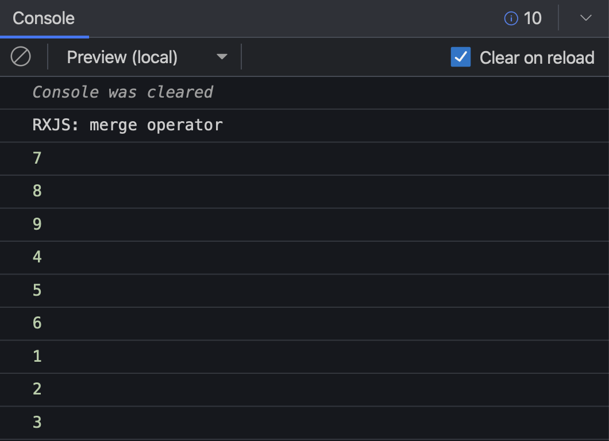
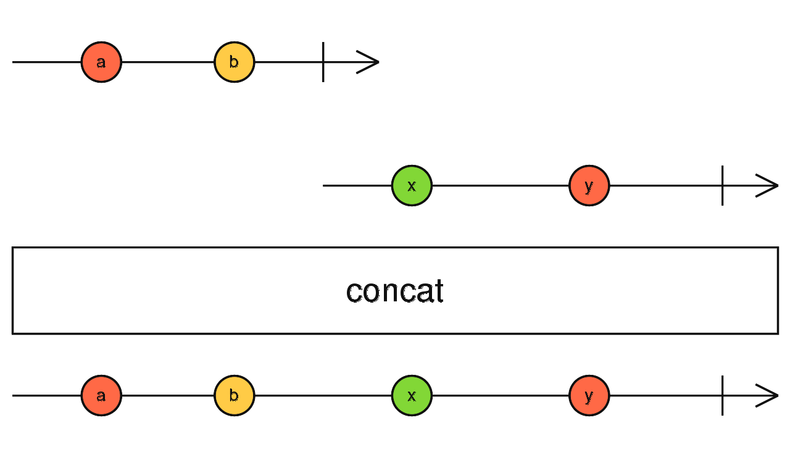

**3PillarGlobal - Training**

Developed by Edwin Sandoval - Frontend Technical Lead
# Laboratory: Introduction to RXJS - Part 4

In this session we're going to learn two new operators that could be used for creating complex operations.

### 1.- merge()

This operator merge several Observable in one Observable. It emits the observable emitted by any of the Observables that were declared as data source, it doesn't enforce the order of each emmited Observable, it just pass the values as they were executed.

Example - [Stackblitz Source Code](https://stackblitz.com/edit/rxjs-gyvxsd?file=index.ts)

    import { of, merge } from 'rxjs';
    import { delay } from 'rxjs/operators';

    console.log('RXJS: merge operator');

    merge(
        // emit after 2 seconds
        of(1, 2, 3).pipe(delay(2000)),
        // emit after 1 second
        of(4, 5, 6).pipe(delay(1000)),
        // emit after 100 millisecons
        of(7, 8, 9).pipe(delay(100))
    )
    // log: 7, 8, 9, 4, 5, 6, 1, 2, 3, 
    .subscribe({
        next: (data) => {
            console.log(data);
        },
    });

As result of executing this code, we're going to get the next results:

### 2.- concat()

This operator allow us to merge several Observables in one Observable. The key behaviour of this operator is that it enforces to consume the data of each Observable that is going to be concatenated in the same order that were defined. It means that second observable is not going to be consumed until the first one emit all its values and completes.

Example - [Stackblitz Source Code](https://stackblitz.com/edit/typescript-99b1rv?file=index.ts)

    import { of, concat } from 'rxjs';
    import { delay } from 'rxjs/operators';

    console.log('RXJS: concat operator');

    concat(
        // emit after 2 seconds
        of(1, 2, 3).pipe(delay(2000)),
        // emit after 1 second
        of(4, 5, 6).pipe(delay(1000)),
        // emit after 100 millisecons
        of(7, 8, 9).pipe(delay(100))
    )
    // log: 1, 2, 3, 4, 5, 6, 7, 8, 9
    .subscribe({
        next: (data) => {
            console.log(data);
        }
    });

As result of executing this code, we're going to get the next results:

