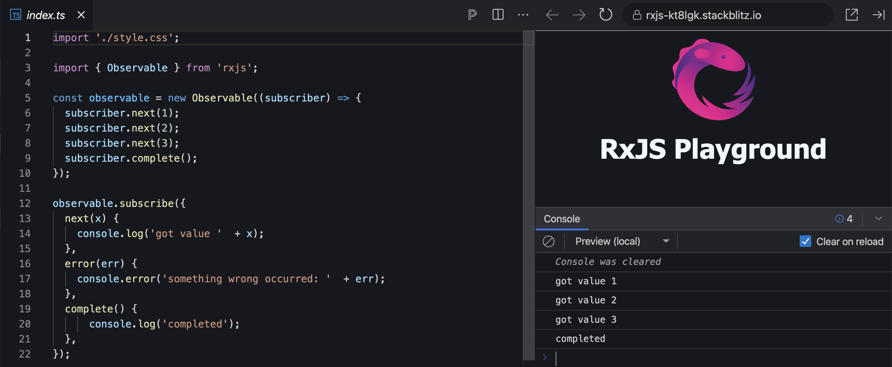

**3PillarGlobal - Training**

Developed by Edwin Sandoval - Frontend Technical Lead
# Laboratory: Introduction to RXJS

In this session, we're going to learn the reactive programming fundamentals through the use of the RXJS that is a library for working with this programming paradigm in Javascript / Typescript.

The reactive programming works around a key concept, the data changes. The idea is that you're going to prepare your code for performing updates in the UI or the State of your application in automatic way, when a change in the data happened, in order to achieve this, you're going to handle your data as data stream that you can define how this data is going to be transformed by operators that are attached to a execution pipe.

## RXJS - Key concepts
- Observable
- Observer
- Subscribe

In order to begin working with this concept of **Reactive Programming**, we're going to use a very popular library that provides all the tools needed, this library is the [RXJS](https://rxjs.dev).

And this library provides several ways for transforming our **plain data** in **data streams**, let's begin explaining how to create an **Observable** (data stream).

For this example, we're going to have the next **three values** 1, 2 and 3 that **we want wrap it in a data stream** for working in a reactive programming style.

1.- First we need to import the **Observable** object from the RXJS library:

    import { Observable } from 'rxjs';

2.- After it, we need to **create** an **Observable**:

    const observable = new Observable((subscriber) => {});

We create a **new instance** of the Observable object and we pass a function as param that is going to receive one object, the subscriber. This object is going to help us to emit each value that compuse our data stream.

3.- Define the data that we want to **emit the values as a data stream**:

    subscriber.next(1);
    subscriber.next(2);
    subscriber.next(3);
    subscriber.complete();

After sending the last value that we want to emit with the help of the **next()** method, our observable should call to **complete()** method in this way we're going to say to each client of this observable that this data stream not have more data, it finished.

4.- Now the code of our observable looks in this way:

    const observable = new Observable((subscriber) => {
	    subscriber.next(1);
	    subscriber.next(2);
	    subscriber.next(3);
	    subscriber.complete();
    });

And in order to be able to consume this data as an stream, we should subscribe to this observable.

5.- Subscribing to the observable:

    observable.subscribe({
	    next(x) {
		    console.log('got value '  + x);
		},
		error(err) {
			console.error('something wrong occurred: '  + err);
		},
		complete() {
		    console.log('done');
		},
	});

For subscribing to an observable, we should call to the method **subscribe()** of the observable and pass as param an object that defines three functions, one for handling the values emitted by the observable, a second for handling errors and the last one for defining what is going to happen after the observable completes.

> Note: An observable can emit values until it completes and in some cases could emit errors messages and we need to be prepare for handling them.

The code for this laboratory could be executed from [stackblitz](https://stackblitz.com/edit/rxjs-kt8lgk?file=index.ts).
